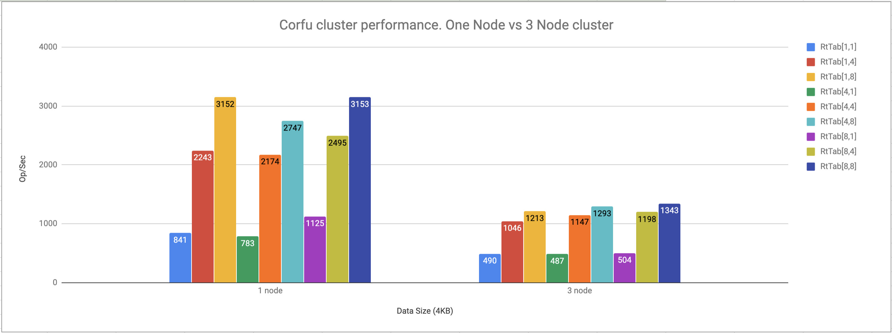

# Corfu Cluster benchmark

This set of Corfu cluster micro benchmarks.

### The Setup
Mac Book Pro 2017
 - Processor 2.8 GHz Intel Core i7
 - 16 GB 2133 MHz LPDDR3
 - SSD (1.3 Gb/sec)

## CorfuTable put
#### One Node Cluster vs Three Node Clster.
 


Conclusion:
  - Chain replication cause 3x performance degradation (by design)
  - IO limit is ~ 100mb per/sec
  - Max performance ~4k records per second
  
###JMH benchmark report:
##### Run complete. Total time: 00:45:15

```
Benchmark                          (dataSize)  (numRuntime)  (numServers)  (numTables)   Mode  Cnt     Score   Error  Units
ClusterBenchmark.clusterBenchmark        4096             1             1            1  thrpt        841.981          ops/s
ClusterBenchmark.clusterBenchmark        4096             1             1            4  thrpt       2243.917          ops/s
ClusterBenchmark.clusterBenchmark        4096             1             1            8  thrpt       3152.255          ops/s
ClusterBenchmark.clusterBenchmark        4096             1             3            1  thrpt        490.199          ops/s
ClusterBenchmark.clusterBenchmark        4096             1             3            4  thrpt       1046.006          ops/s
ClusterBenchmark.clusterBenchmark        4096             1             3            8  thrpt       1213.021          ops/s
ClusterBenchmark.clusterBenchmark        4096             4             1            1  thrpt        783.168          ops/s
ClusterBenchmark.clusterBenchmark        4096             4             1            4  thrpt       2174.999          ops/s
ClusterBenchmark.clusterBenchmark        4096             4             1            8  thrpt       2747.375          ops/s
ClusterBenchmark.clusterBenchmark        4096             4             3            1  thrpt        487.163          ops/s
ClusterBenchmark.clusterBenchmark        4096             4             3            4  thrpt       1147.542          ops/s
ClusterBenchmark.clusterBenchmark        4096             4             3            8  thrpt       1293.505          ops/s
ClusterBenchmark.clusterBenchmark        4096             8             1            1  thrpt       1125.454          ops/s
ClusterBenchmark.clusterBenchmark        4096             8             1            4  thrpt       2495.136          ops/s
ClusterBenchmark.clusterBenchmark        4096             8             1            8  thrpt       3153.518          ops/s
ClusterBenchmark.clusterBenchmark        4096             8             3            1  thrpt        504.616          ops/s
ClusterBenchmark.clusterBenchmark        4096             8             3            4  thrpt       1198.030          ops/s
ClusterBenchmark.clusterBenchmark        4096             8             3            8  thrpt       1343.805          ops/s
ClusterBenchmark.clusterBenchmark     2097152             1             1            1  thrpt         52.307          ops/s
ClusterBenchmark.clusterBenchmark     2097152             1             1            4  thrpt         57.000          ops/s
ClusterBenchmark.clusterBenchmark     2097152             1             1            8  thrpt         58.998          ops/s
ClusterBenchmark.clusterBenchmark     2097152             1             3            1  thrpt         16.264          ops/s
ClusterBenchmark.clusterBenchmark     2097152             1             3            4  thrpt         11.574          ops/s
ClusterBenchmark.clusterBenchmark     2097152             1             3            8  thrpt         12.581          ops/s
ClusterBenchmark.clusterBenchmark     2097152             4             1            1  thrpt         52.972          ops/s
ClusterBenchmark.clusterBenchmark     2097152             4             1            4  thrpt         53.235          ops/s
ClusterBenchmark.clusterBenchmark     2097152             4             1            8  thrpt         56.991          ops/s
ClusterBenchmark.clusterBenchmark     2097152             4             3            1  thrpt         18.732          ops/s
ClusterBenchmark.clusterBenchmark     2097152             4             3            4  thrpt         18.313          ops/s
ClusterBenchmark.clusterBenchmark     2097152             4             3            8  thrpt         17.874          ops/s
ClusterBenchmark.clusterBenchmark     2097152             8             1            1  thrpt         58.450          ops/s
ClusterBenchmark.clusterBenchmark     2097152             8             1            4  thrpt         54.340          ops/s
ClusterBenchmark.clusterBenchmark     2097152             8             1            8  thrpt         57.237          ops/s
ClusterBenchmark.clusterBenchmark     2097152             8             3            1  thrpt         17.224          ops/s
ClusterBenchmark.clusterBenchmark     2097152             8             3            4  thrpt         17.205          ops/s
ClusterBenchmark.clusterBenchmark     2097152             8             3            8  thrpt         14.001          ops/s
```