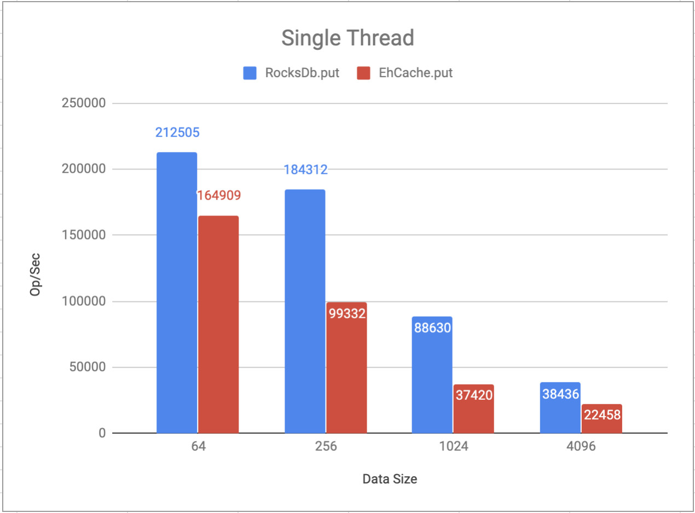
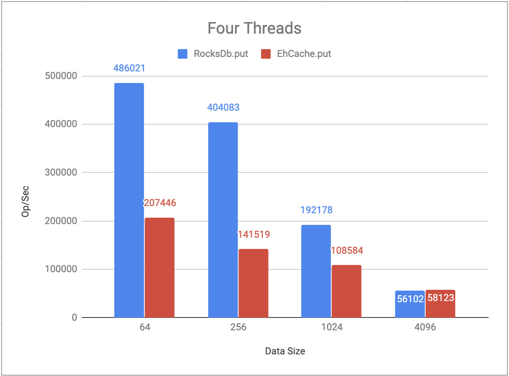
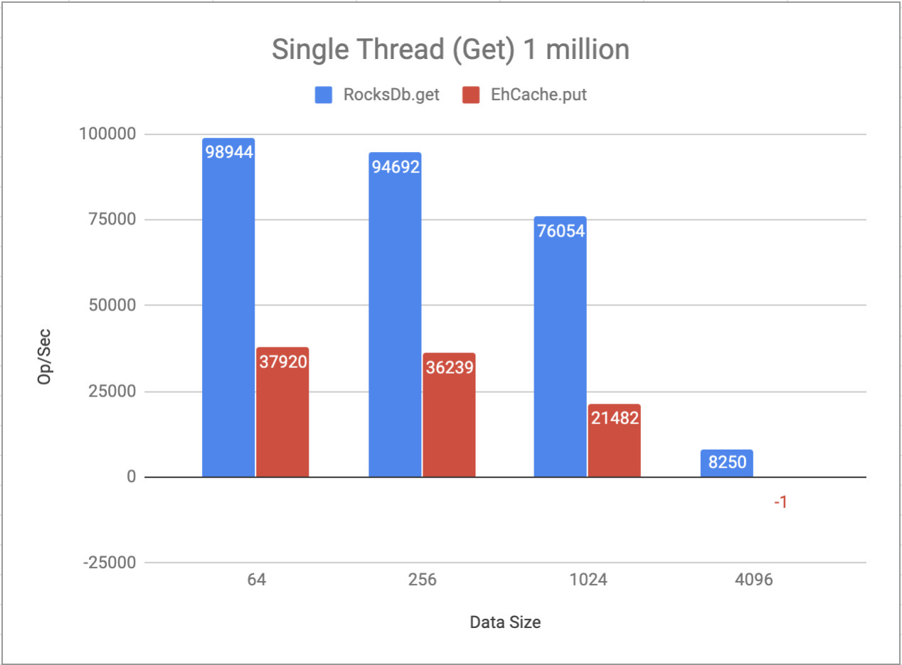
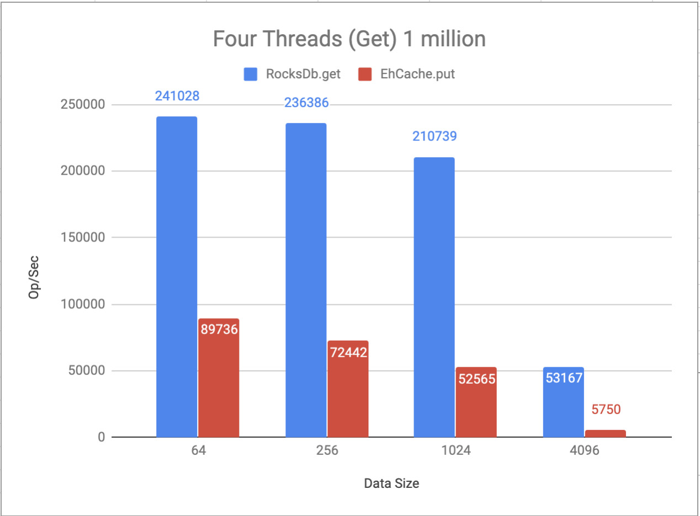

# Large Corfu Table benchmark

This set of micro benchmarks compares EhCache vs RocksDb performance characteristics.

### The Setup
Mac Book Pro 2017
 - Processor 2.8 GHz Intel Core i7
 - 16 GB 2133 MHz LPDDR3
 - SSD

#### RocksDb parameters:
 - disable WAL
 - increase WriteBufferSize to 256 mb
 - increase MaxWriteBufferNumber from 2 to 4

#### EhCache parameters:
 - max heap entries 100.000
 - max disk quota (mb) 50.000

## PUT
#### Single thread `Put` method. 




#### Four threads `Put` method.
 


## GET
#### Single thread `Get` method. 




#### Four threads `Get` method.
 


EhCache can't manage 10 million records data set, it throws GC error.

RocksDb 50-100% faster than EhCache for single threaded application.
RocksDb provides better performance for multithreaded applications.

Conclusion:
  - RocksDb more stable and solid solution then EhCache 
  - RocksDb provides higher throughput
  - RocksDb more flexible: it provides a big number of the parameters and almost all the parameters can be tuned
  - EhCache can be used for relatively small data sets but it's slower and doesn't provide any advantages over RocksDb

JMH benchmark sample report:
# Run complete. Total time: 00:13:46

```
Benchmark                       (dataSize)  (tableSize)   Mode  Cnt       Score         Error  Units
CorfuTableBenchmark.ehCacheGet          64      1000000  thrpt    3   85078.006 ±  545639.183  ops/s
CorfuTableBenchmark.ehCacheGet         256      1000000  thrpt    3   76294.511 ±  398374.714  ops/s
CorfuTableBenchmark.ehCacheGet        1024      1000000  thrpt    3   44327.660 ±  578658.440  ops/s
CorfuTableBenchmark.ehCacheGet        4096      1000000  thrpt    3    8982.028 ±   55393.835  ops/s
CorfuTableBenchmark.ehCachePut          64          N/A  thrpt    3  315051.698 ±  637515.680  ops/s
CorfuTableBenchmark.ehCachePut         256          N/A  thrpt    3  285238.559 ±  773907.017  ops/s
CorfuTableBenchmark.ehCachePut        1024          N/A  thrpt    3  130515.747 ± 1706760.978  ops/s
CorfuTableBenchmark.ehCachePut        4096          N/A  thrpt    3   44611.865 ±  782480.110  ops/s
CorfuTableBenchmark.rocksDbGet          64      1000000  thrpt    3  228773.426 ±   41362.531  ops/s
CorfuTableBenchmark.rocksDbGet         256      1000000  thrpt    3  225803.740 ±   80702.943  ops/s
CorfuTableBenchmark.rocksDbGet        1024      1000000  thrpt    3  202062.208 ±   88179.606  ops/s
CorfuTableBenchmark.rocksDbGet        4096      1000000  thrpt    3   41602.429 ±   93781.669  ops/s
CorfuTableBenchmark.rocksDbPut          64          N/A  thrpt    3  199669.662 ±  450341.389  ops/s
CorfuTableBenchmark.rocksDbPut         256          N/A  thrpt    3  182789.600 ±  637363.393  ops/s
CorfuTableBenchmark.rocksDbPut        1024          N/A  thrpt    3   91563.703 ±  958712.791  ops/s
CorfuTableBenchmark.rocksDbPut        4096          N/A  thrpt    3   38778.374 ±  122246.692  ops/s 
```