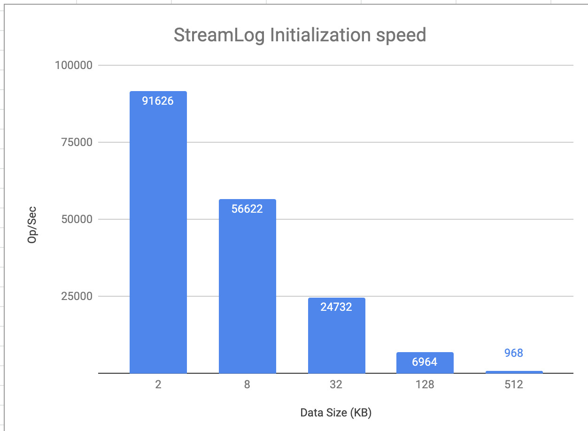

# StreamLog benchmarks

This set of micro benchmarks measures StreamLog performance.

### The Setup
Mac Book Pro 2017
 - Processor 2.8 GHz Intel Core i7
 - 16 GB 2133 MHz LPDDR3
 - SSD

### Info
 - data segment size: 10_000 entries

## Initialization
#### The benchmark measures how fast a data segment can be loaded



Conclusion:
  - The poor performance of loading data segments
  - Inefficient and data intensive operation. It loads all the data to build small index, 
  almost all resources spending on loading data which is a redundant operation.
  - For instance, we have 10mil records, average size of each record 2kb. 
  Stream log can read 9 segments per second. The total time would be: 10mil/10_000/9=111 seconds.
  Also it will read all the data from the disk: 10mil*2kb=20gb.

#### JMH benchmark sample report:
```
Benchmark                              (dataSize)   Mode  Cnt      Score       Error  Units
StreamLogFilesBenchmark.streamLogInit           2  thrpt    3  91626.152 ± 35944.586  ops/s
StreamLogFilesBenchmark.streamLogInit           8  thrpt    3  56622.461 ± 17135.524  ops/s
StreamLogFilesBenchmark.streamLogInit          32  thrpt    3  24732.443 ± 18926.436  ops/s
StreamLogFilesBenchmark.streamLogInit         128  thrpt    3   6964.163 ±  7695.424  ops/s
StreamLogFilesBenchmark.streamLogInit         512  thrpt    3    968.793 ±   221.574  ops/s
```