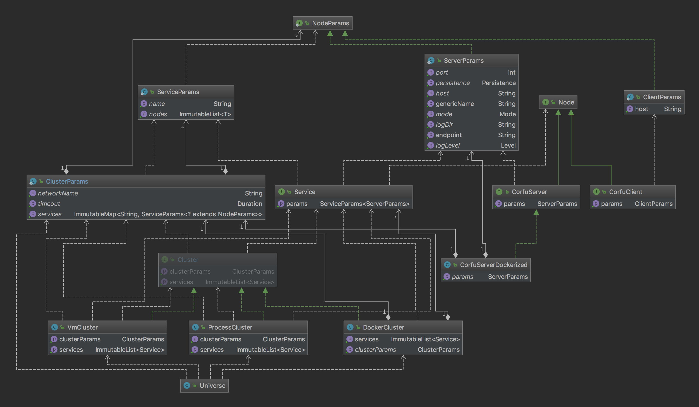

# Integration testing in CorfuDB

Integration testing is often a difficult venture, especially when it comes to distributed systems.
This testing framework helps to speed up this process by making it easier to link together services in a cluster.

### The idea
Provide an abstraction of `cluster` that enables us work with distributed applications as logical services and manage them. 
Provide API to write complex testing scenarios for distributed applications, checking correctness of the application state. 

### Design:
 - project - integtest is a module of corfu db maven project. 
 - running tests by `mvn clean integration-test`

### Concepts:
 Universe framework provides the API objects to describe your cluster’s desired state: what services and applications 
 you want to run and manage, scaling parameters and more.
 - `Universe` - a Factory which builds different types of Clusters for you: Vm, Docker, Process.
 - `Cluster` - represents a cluster as a group of services (and eventually a collection of nodes). 
    Cluster provides methods to start and stop cluster, configure, add and remove services. 
    Cluster Configured by `ClusterParams`.
 - `Service` is an abstraction which defines a logical unit that provides some functional - sometimes called a micro-service. 
    Service is a set of nodes of the same type.
    Services provide important features that are standardized across the cluster, it could be: 
    load-balancing, service discovery mechanism, and features to support zero-downtime application deployments (not implemented yet).
 - Node represents an application in a cluster. Node could be a docker container or just an jvm process inside VM.
   Managing a node means to manage a particular application: start, stop, remove etc.  
 - `Params` - ClusterParams, ServiceParams, NodeParams and so on, configures desired state of the cluster. 
   Applying params to the cluster makes the cluster’s current state match the desired state.

 
### Lifecycle:
 #### maven `mvn clean integration-test`:
 - build a corfu `infrastructure` shaded jar (corfu server).
 - copy the infrastructure jar into `integtest/target/corfudb` directory.
 - build a docker image which contains the jar - corfudb-image.
 
 #### Basic integration test:
 - create a user network
 - start container using corfudb-image, map docker port to host port
 - create CorfuRuntime and connect to the container
 - work with db
 - check test result
 - delete network, kill container, remove container

#### === The idea of docker cluster implementation ===
 - Build a docker image of a corfu server.
 - Use spotify docker-client to declare the needed infrastructure for each test case.
 - Start up the infrastructure with docker-client and execute tests.
 
### Docker cluster advantages:
 - Completely isolated environment for each db instance.
 - Full programmatic control on the container in tests during execution time. 
   Rich docker API allows manage any part of container lifecycle out of the box.
 - You are given your own virtual network. 
   It's quite easy to manipulate nodes (add, delete or exclude it from the network and then join it again). 
   Partitioning can be done easily using docker network api.
 - Easy access to any node logs. Mac has the UI (Kitematic) that makes it even easier.
 - Allows to bring any needed infrastructure services in the test for additional analytics, for instance it could be ELK or Grafana, 
   which makes post analytics easier.
 
### Docker cluster Issues/workarounds:
 - `--network=host` parameter not supported in MacOS, workaround is use fake dns on host
 
### Docker cluster design:

